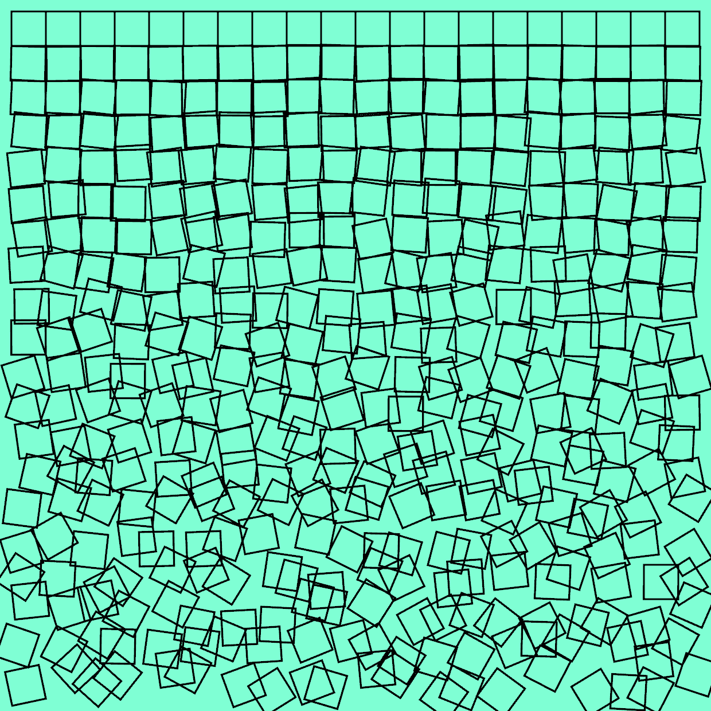

# Schotter Squares



This program generates square editions stylized after Schotter by Georg Nees. The code is inspired by [this tutorial](https://github.com/sidwellr/schotter/). A series of 20 Schotter Squares generated by this program will be sold as NFTs on the Stellar Network.

## Running the program

Run the program using this command in the root directory:

```
cargo run --release
```

When you run the program, a GUI will open. There are a few key commands available in the running program:

* S - Saves an image to an output/ folder
* R - Refreshes the image with a new random seed
* C - Change the background color
* Down - Adjust the squares down
* Up - Adjust the squares up
* Right - Adjust the squares rotation right
* Left - Adjust the squares rotation left

To exit the program, close the GUI window.